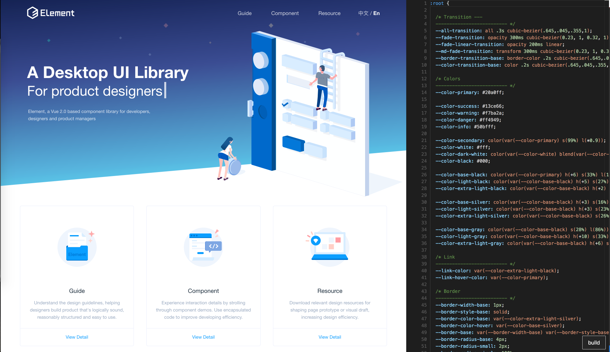

# element-themer

> a simple themer that make diy element theme easier

## how to run 
```
git clone https://github.com/foolishchow/element-themer.git
cd element-themer
yarn 
// download the example page
yarn down
yarn dev
```
edit your theme   
after build page will auto reload


> ps:
this pro is a simple and poor coded  
some code might have bugs also  
you can make it with `electron` to make it better   
have fun ~
